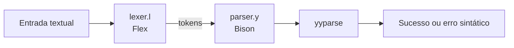

# Arquitetura

O compilador é dividido em fases pequenas. O Flex identifica os elementos da entrada e o Bison verifica se a sequência de elementos forma uma expressão válida.



## Responsabilidades

| Componente | Papel |
| --- | --- |
| `lexer/lexer.l` | Converte números, operadores e parênteses em tokens. |
| `parser/parser.y` | Declara a gramática e chama `yyerror` quando a sequência é inválida. |
| `src/main.c` | Ponto reservado para a evolução do programa principal. |
| `lex.yy.c` | Código C gerado pelo Flex. |
| `parser.tab.c` | Código C gerado pelo Bison. |

## Fluxo de uma expressão

Para a entrada `8 * (2 + 1)`, o lexer produz aproximadamente:

```text
NUM TIMES LPAREN NUM PLUS NUM RPAREN
```

O parser recebe esses tokens e tenta reduzi-los pelas regras de `expressao`. Nesta etapa, a gramática ainda não define precedência entre operadores; essa é uma boa próxima evolução do projeto.

!!! tip "Regra de ouro"
    Quando uma fase mudar, regenere os arquivos derivados (`lex.yy.c`, `parser.tab.c` e `parser.tab.h`) para que o executável reflita a fonte atual.